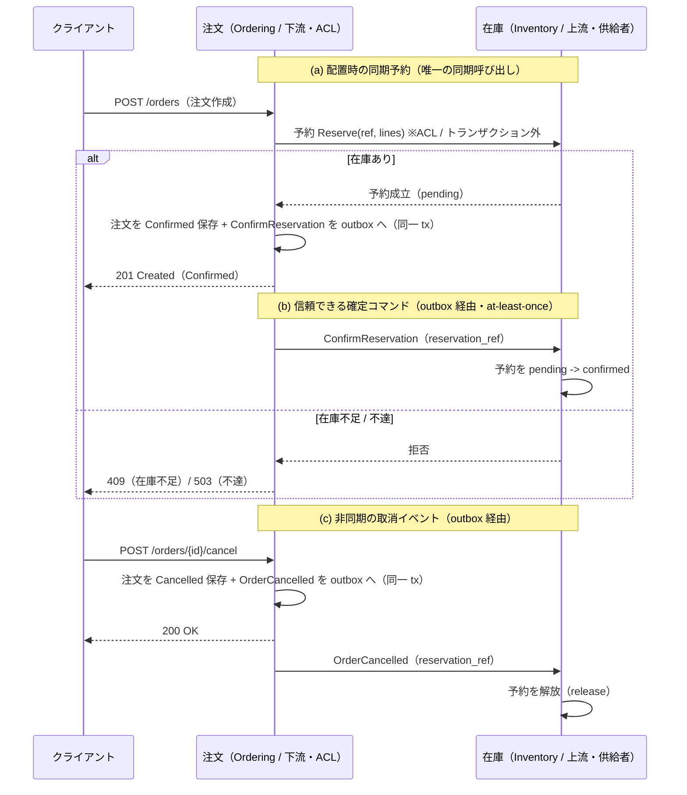

# コンテキストマップ（seam の 3 フロー）

このリポジトリの中心は、2 つの境界づけられたコンテキスト **在庫（Inventory）** と
**注文（Ordering）** をつなぐ **seam（縫い目）** の実装です。ここでは、その seam を成す
3 つのフローを説明します。契約とコードの実体は参照先に置き、ここでは関係と流れだけを示します。

> **「なぜこの境界なのか」はこの文書の範囲外です** — 在庫と注文の 2 つに割った導出過程
> （語の衝突・トランザクション境界・変更理由の違い）と、却下した代替案は
> [why-these-boundaries.md](./why-these-boundaries.md) にあります。この文書は
> **境界を決めたあとの関係と流れ**を扱います。境界ごとの語彙は
> [glossary.md](./glossary.md) を参照してください。

## 関係（コンテキスト間の役割）

- **在庫 = 上流（Upstream） / 供給者（Supplier）**。注文の存在を知りません（「注文」という
  概念を持たない）。予約という語彙だけを内部 API で公開します。
- **注文 = 下流（Downstream） / 顧客（Customer）**、かつ **腐敗防止層（ACL）を持つ側**。
  在庫のドメイン型を一切知らず、翻訳済み DTO（`ordering/port.ReserveLine`）と、在庫の内部 API
  から生成したクライアント（`clients/inventory`）越しにのみ在庫へ到達します。

依存の向きは **注文 → 在庫** の一方向で、静的解析（depguard）が機械的に守ります。注文は
在庫の Go パッケージを import せず、HTTP 越し（分散構成）または公開シームの直接呼び出し
（`cmd/dev` の同一プロセス構成）でのみ到達します。

## 図（Mermaid・テキストフォールバック併記）

<!-- テキストフォールバック（Mermaid が描画されない場合）:
(a) 同期予約: クライアント -> 注文 POST /orders。注文は ACL 越しに在庫へ Reserve(ref, lines) を
    トランザクションの外で同期呼び出し。成立すれば注文を Confirmed 保存し、同一 tx で
    ConfirmReservation を outbox へ積む。在庫不足なら 409、在庫不達なら 503。
(b) 確定コマンド: 注文の outbox 中継が ConfirmReservation を在庫へ届け（at-least-once）、
    在庫は該当予約を pending -> confirmed にする。
(c) 取消イベント: クライアント -> 注文 POST /orders/{id}/cancel。注文は Cancelled 保存と
    同一 tx で OrderCancelled を outbox へ積む。在庫はそれを購読して予約を解放する。
    下流（注文）から上流（在庫）への同期呼び出しはしない。
-->

## (a) 配置時の同期予約（synchronous reserve）

- 注文作成時に、注文 ID から**決定的に導出した予約参照（reservation_ref）**で在庫を**同期予約**
  します。これが seam で唯一の同期呼び出しです。
- 呼び出しは腐敗防止層（`aclhttp`）→ 生成クライアント（`clients/inventory`）→ 在庫の内部 API。
  **トランザクションの外**で呼びます（HTTP が DB トランザクションを跨いで保持されるのを避ける）。
- 在庫側の失敗は注文側の番兵へ翻訳します。在庫不足（在庫の 409）→ `ErrReservationRejected`
  （→ HTTP 409）、不達・タイムアウト・5xx → `ErrReservationUnavailable`（→ HTTP 503）。
  在庫側の番兵名は漏らしません。
- 実装: `contexts/ordering/internal/application/place_order.go`、`.../adapter/outbound/aclhttp/`、
  契約は `contracts/inventory/internal.openapi.yaml`。

## (b) 信頼できる確定コマンド（reliable `ConfirmReservation`）

- 予約が成立したら、注文を **Confirmed 保存するのと同一トランザクション**で `ConfirmReservation`
  コマンドをアウトボックスへ積みます（二重書き込みを避ける）。注文が durable になれば、確定は
  **at-least-once で必ず**在庫へ届きます。
- これは「二相予約」の第 2 相です。在庫はコマンドを受けて予約を **pending → confirmed** にします。
- 受信は冪等（既に confirmed なら no-op、速い取消で解放済みなら良性の警告ログ）です。遅延／消失した
  確定の整合は、注文側にコード分岐や `Failed` 状態を持たせず、両サービスのログを共有 `trace_id`
  （W3C traceparent）で相関して**運用レベル**で行います。
- 契約: `contracts/events/confirm_reservation.schema.json`。送信は注文の `messages.go`、受信は
  在庫の `subscriber.go`（`OnConfirmReservation`）。

## (c) 非同期の取消イベント（asynchronous `OrderCancelled`）

- 取消時は、注文を **Cancelled 保存するのと同一トランザクション**で `OrderCancelled` イベントを
  アウトボックスへ積みます。在庫はそれを購読して**非同期に予約を解放**します。
- 下流（注文）から上流（在庫）への同期呼び出しはしません（上流は下流を知らないまま、イベント契約
  だけで反応する）。
- 契約: `contracts/events/order_cancelled.schema.json`。受信は在庫の `subscriber.go`
  （`OnOrderCancelled` → `Release`）。冪等なので再配送のもとでも安全です。

## 共通の機構と注意

- **(b) と (c) は同じアウトボックス機構**（`shared/outbox`）で注文 → 在庫へ流れます。送出は
  `outbox.Runner` が at-least-once で行い、受信は `outbox.Router` が `message_type` で `Consumer`
  へ振り分けます。**(a) のみ同期**です。
- **タイミングの注意**: `cmd/dev`（Docker 不要）の同期 in-process publisher は、(b)(c) を即時配送
  します。これは decoupling（注文が在庫のドメイン型を知らずに契約だけで到達すること）を示しますが、
  **遅延ある eventual consistency（結果整合）のタイミングは示しません**。遅延を伴う本物の結果整合は、
  PostgreSQL のアウトボックス + 送信中継（`docker compose` 経路）で観察できます。
